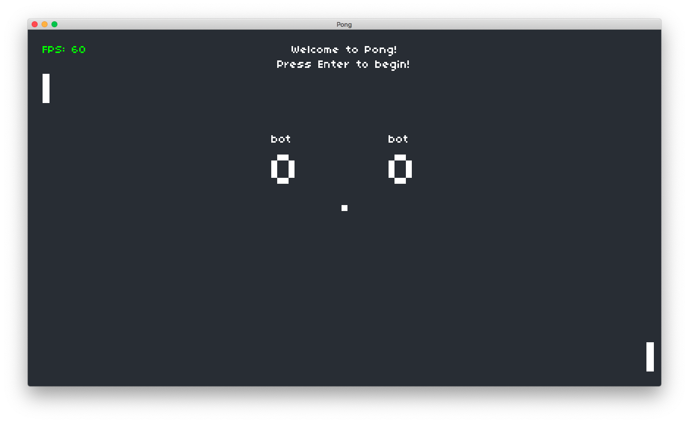

# Pong

Atari's 1972 classic, implemented in Lua with LÖVE.

## Assignment 0: "Pong, The AI Update"

Code for **Assignment 0** of [CS50's Introduction to Game Development](https://online-learning.harvard.edu/course/cs50s-introduction-game-development).

The game now supports two `types` of Paddles, `human` and `bot`.

The `bot` player follows the ball as it moves, so it's very hard to beat in its current implementation.

I'll try to add a difficulty selector in the future, to give humans a chance. 😅

### Game Mode

The default Game Mode is `bot-human`, which means Player 1 plays as a `bot`, and Player 2 is `human` controlled.

Additional modes can be activated via command-line arguments:

```bash
love . $MODE
```

Where `$MODE` is one of:

- `bot-human` (default)
- `human-human`
- `bot-bot`

## Demo Video

[](https://youtu.be/WclHCTPT_gw)

## Notes

The code has been upgraded to run on the latest version of LÖVE 2D —11.3 (Mysterious Mysteries).